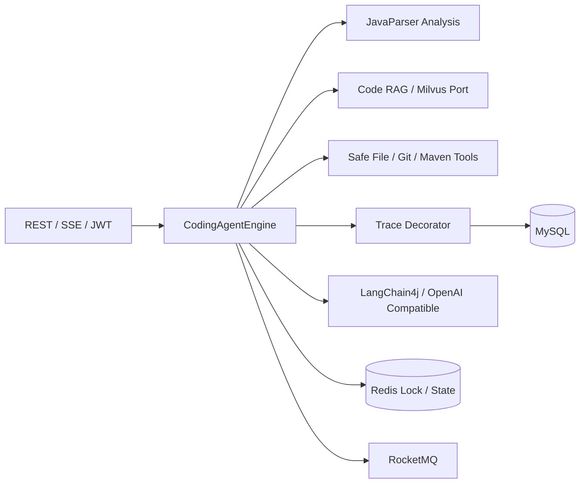
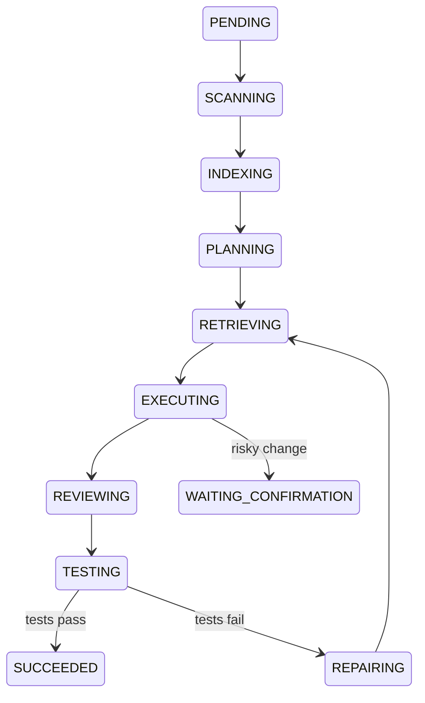

# Java Coding Agents

基于 Java 17、Spring Boot 3、LangChain4j 与 JavaParser 构建的 Java 编程智能体。它面向真实 Maven 仓库，提供代码扫描、增量索引、结构化规划、代码检索、安全文件修改、Git Diff、测试、自修复和执行轨迹查询等能力。

## 核心能力

- **代码分析**：通过 JavaParser 提取类、接口、枚举、方法、构造器和字段等 AST 符号。
- **Code RAG**：按语义符号切片，基于 SHA-256 建立增量索引，并支持路径、符号和关键词的混合检索。
- **工具调用**：统一使用结构化 `ToolResult`，提供受控文件读写、局部 Patch、只读 Git/Maven 命令和任务快照。
- **自动修复**：测试失败后解析结构化错误，重新检索、修改并测试；支持最大轮次、重复错误、无效变更和危险操作等停止条件。
- **执行追踪**：以 `traceId`、`taskId` 和 `sessionId` 关联计划、工具、文件、测试与修复事件，不保存模型隐藏推理。
- **安全控制**：限制工作区路径与可执行命令，敏感文件和高风险变更进入人工确认流程。

## 系统架构



## 执行流程



## 项目模块

| 模块 | 职责 |
| --- | --- |
| `coding-agent-bootstrap` | 应用启动、Bean 装配、JWT/Security、Metrics 和配置 |
| `coding-agent-api` | REST、SSE、DTO、参数校验与异常处理 |
| `coding-agent-core` | Supervisor、规划/编码模型、状态机和自动修复 |
| `coding-agent-analysis` | Maven 仓库扫描与 JavaParser AST 符号分析 |
| `coding-agent-rag` | 语义切片、增量索引与混合检索 |
| `coding-agent-tools` | 安全文件、Git、Maven、快照和回滚工具 |
| `coding-agent-trace` | 结构化 Trace 与异步写入 |
| `coding-agent-infrastructure` | LangChain4j、MySQL、Redis、RocketMQ 和 JGit 适配 |
| `coding-agent-common` | 公共领域对象与 API 响应模型 |

## 技术栈

- Java 17
- Spring Boot 3.4
- Maven 多模块工程
- LangChain4j / OpenAI Compatible API
- JavaParser
- MySQL、Redis、Milvus、RocketMQ
- JWT、Spring Security、Springdoc OpenAPI
- JUnit 5、Testcontainers

## 快速开始

### 环境要求

- JDK 17+
- Maven 3.9+
- Docker 与 Docker Compose（运行外部服务时需要）

### 1. 运行测试

```bash
mvn -s .mvn/settings.xml test
```

### 2. 启动基础设施

```bash
docker compose -f deploy/docker-compose.yml up -d
```

### 3. 启动应用

```bash
mvn -s .mvn/settings.xml -pl coding-agent-bootstrap -am spring-boot:run
```

应用默认监听 `http://localhost:8080`，Swagger UI 位于：

```text
http://localhost:8080/swagger-ui.html
```

## 配置项

| 环境变量 | 说明 |
| --- | --- |
| `LLM_BASE_URL` | OpenAI Compatible API 地址 |
| `LLM_MODEL_NAME` | 模型名称 |
| `LLM_API_KEY` | 模型 API Key；未配置时使用确定性离线模型 |
| `JWT_SECRET` | JWT 密钥，建议至少 32 字节 |
| `ADMIN_USERNAME` | 管理员用户名 |
| `ADMIN_PASSWORD` | 管理员密码 |
| `AGENT_WORKSPACE_ROOT` | 代码仓库工作区根目录，默认 `./workspaces` |
| `AGENT_MAX_REPAIR_ATTEMPTS` | 最大自动修复次数，默认 `3` |
| `SERVER_PORT` | HTTP 服务端口，默认 `8080` |

> 请通过环境变量注入密钥，不要把真实凭据提交到仓库。

## API 示例

获取访问令牌：

```bash
curl -X POST http://localhost:8080/api/auth/token \
  -H "Content-Type: application/json" \
  -d '{"username":"admin","password":"your-password"}'
```

创建代码仓库记录：

```bash
curl -X POST http://localhost:8080/api/repositories \
  -H "Authorization: Bearer TOKEN" \
  -H "Content-Type: application/json" \
  -d '{"name":"demo","workspacePath":"/workspace/demo","userId":1}'
```

创建编程任务：

```bash
curl -X POST http://localhost:8080/api/agent/tasks \
  -H "Authorization: Bearer TOKEN" \
  -H "Content-Type: application/json" \
  -d '{"repositoryId":1,"requirement":"增加手机号验证码登录并补充测试","maxRepairCount":3}'
```

任务相关接口包括：

- `GET /api/agent/tasks/{taskId}/trace`
- `GET /api/agent/tasks/{taskId}/tools`
- `GET /api/agent/tasks/{taskId}/changes`
- `GET /api/agent/tasks/{taskId}/tests`
- `GET /api/agent/tasks/{taskId}/metrics`
- `GET /api/agent/tasks/{taskId}/events`

## 自动修复示例

`examples/sample-user-service` 是一个可独立测试的示例服务。真实模型返回结构化 `ChangeProposal`，引擎仅通过文件工具应用 Patch，然后执行 `git diff` 和 `mvn test`。失败输出会转换为 `StructuredError` 并进入下一轮修复。

## 安全边界

- 所有文件路径必须位于仓库根目录内。
- 拒绝路径穿越、外部符号链接以及 `.env`、私钥等敏感文件。
- 命令执行采用白名单，只允许 Maven、Maven Wrapper、只读 Git 命令和 `java -version`。
- 构建文件、数据库迁移、鉴权逻辑或超过十个文件的变更需要人工确认。
- Trace 会对 Key、Token、Password、Secret 和 Authorization 等字段脱敏。

## 测试范围

项目包含 AST/RAG、状态机、自动修复策略、路径穿越防护、命令白名单、文件回滚、Trace 和 JWT 等测试。未配置 API Key 时不会访问模型；依赖外部服务的 Testcontainers 测试可在 Docker 可用时运行。

## 架构决策

详细设计取舍参见 [docs/architecture-decisions.md](docs/architecture-decisions.md)。

## 后续计划

- Milvus 原生 SDK 批量写入
- RocketMQ 消费者弹性扩缩容
- Prometheus / Grafana Dashboard
- 更多编程语言解析器
- Git worktree 隔离

